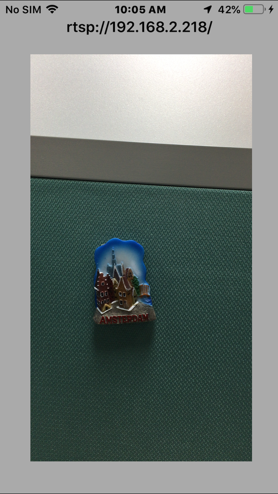

# H264-RTSP-Server-iOS 

- Make your iPhone be a RTSP IPCamera!

- Hardware Video Encoding on iPhone — RTSP Server example

- This is an unofficial mirror of the great work by the guys at `GDCL`: [iOS-Video-Encoding](http://www.gdcl.co.uk/2013/02/20/iOS-Video-Encoding.html).

## Features
- Support Rtsp streaming.
- Support iOS14.
- Provide a demo that using this project as a RTSP IPCamera and `IRIPCamera` as a RTSP Player.
    - See [IRIPCamera](https://github.com/irons163/IRIPCamera).

## How the demo works?
- Prepare 2 iPhones, connecting them in the same network.
- Run ths project in an iPhone, it would show the local IP in the top of the screen.
- Run [IRIPCamera](https://github.com/irons163/IRIPCamera) in the other iPhone, type the RTSP Url into the setting page.
- Enjoy your personal iPhoneCam : )

## Install
### Git
- Git clone this project.

### Cocoapods
- Not support yet.

## Screenshots
|Display|
|---|
||
